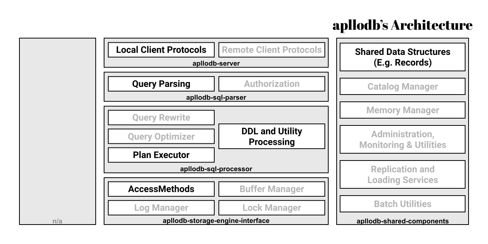

# apllodb


apllodb is a RDBMS purely written in Rust.

It has the following distinguished features:

- **Plugable storage engine:**
  - Implementing apllodb's storage engine is unambiguous. Your storage engine crate just depends on `apllodb-storage-engine-interface` crate and implements `StorageEngine` trait (and its associated types).
  - apllodb's default storage engine is **Immutable Schema** Engine (`apllodb-immutable-schema-engine`). This engine never deletes / requires to delete old records on `UPDATE`, `DELETE`, even on `ALTER TABLE` and `DROP TABLE`.

Also, we have plan to develop the following unique features:

- Ambiguous data ("about 100 years ago", for example) and query toward them.
- Algebraic data type as SQL types.

## Development

This repository is a [multi-package project](https://doc.rust-lang.org/edition-guide/rust-2018/cargo-and-crates-io/cargo-workspaces-for-multi-package-projects.html).

You are supposed to have installed [Cargo](https://github.com/rust-lang/cargo) and [cargo-make](https://github.com/sagiegurari/cargo-make).

```bash
# (clone repository)

cd apllodb
cargo make test

# (write your code)
cargo make build
cargo make test

# (before making pull-request)
cargo make format
cargo make lint

# (generate rustdoc)
cargo make doc
```

## Architecture

We refer to ["Architecture of a Database System"](https://dsf.berkeley.edu/papers/fntdb07-architecture.pdf) to set boundaries between each components (crates).

The following diagram, similarly illustrated to Fig. 1.1 of the paper, shows sub-crates and their rolls.
(Box with gray text are unimplemented roles)



Entry points in `apllodb-server`, `apllodb-sql-processor`, and `apllodb-storage-engine-interface` are **async** functions so clients can run multiple SQLs at a time.

`apllodb-server` is the component to choose storage engine to use. `apllodb-immutable-schema-engine::ApllodbImmutableSchemaEngine` is specified at compile-time (as type parameter) for now.

Currently, apllodb has a single client; `apllodb-cli`. `apllodb-cli` runs from a shell, takes SQL text from stdin, and outputs query result records (or error messages) to stdout/stderr.
Also, `apllodb-cli` works as single-process database. `apllodb-server` currently does not run solely.

Of course we have plan to:

- Split server and client.
- Provides client library for programming languages (Rust binding may be the first one).

## Further Readings

(Most of them are private and written in Japanese currently.)

- [要求分析](https://docs.google.com/document/d/1J6_MWObo0VVo-ATrwALpoNUHBUbSvrxHV8XuBcs_tIM/edit)
- [要件定義](https://docs.google.com/document/d/1djtGGMope8eCJOMjDXl0DvjpUrwlGjHygUN8n0M-0WI/edit#heading=h.hhevn0icya3z)
- [仕様策定](https://docs.google.com/document/d/1yUgI-_hqPYiVBPYWQosuo3idVzAjbq29GgyS72N4SAs/edit)

- [Immutable Schema で解決したい課題](https://github.com/darwin-education/apllodb/wiki/Immutable-Schema-000:-%E8%A7%A3%E6%B1%BA%E3%81%97%E3%81%9F%E3%81%84%E8%AA%B2%E9%A1%8C)
- [Immutable Schema 仕様書一覧](https://github.com/darwin-education/apllodb/wiki/Immutable-Schema-100:-%E4%BB%95%E6%A7%98%E6%9B%B8%E4%B8%80%E8%A6%A7)
