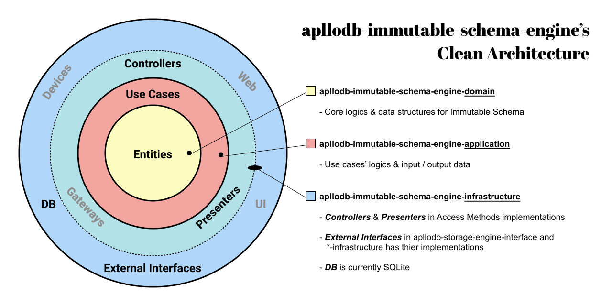

# apllodb-immutable-schema-engine

An apllodb's storage engine implementation.

## Installation

```toml
[dependencies]
apllodb-immutable-schema-engine = "0.1"
```

This crate provides:

- Immutable Schema
  - Immutable DDL
  - Immutable DML
- ACID transaction

## Architecture

apllodb-immutable-schema-engine is a storage engine of apllodb. In other words, apllodb-immutable-schema-engine has access methods (see section 4.5 of ["Architecture of a Database System"](https://dsf.berkeley.edu/papers/fntdb07-architecture.pdf)) implementations, whose interfaces are in apllodb-storage-engine-interface crate.

The most distinguished part of this engine is logics and data structures for Immutable Schema.
apllodb-immutable-schema-engine applies [Clean Architecture](https://blog.cleancoder.com/uncle-bob/2012/08/13/the-clean-architecture.html) in order to put Immutable Schema implementation within Enterprise Business Rules / Applications Business Rules layers (also called Domain / Application layers). Then the core logics and data structures are independent of persistent data format (like B-Tree), transaction management, and buffer management.

Currently SQLite is used in Frameworks & Derivers layer (or Infrastructure layer) for persistent storage and transaction management but we have plant to replace it into our original implementation for better performance.

Here is the diagram describing Clean Architecture used in `apllodb-immutable-schema-engine-*` sub-crates.



Note that Interface Adapters layer is not used for the following reasons.

- **Controllers**: Some of access methods implementations in infrastructure layer do the controller work. They get inputs from storage engine callers, convert into use cases' input data, and call use cases. Other access methods do their work completely inside infrastructure layer without calling use cases. Access methods to manage transactions, for example, access transaction data implemented in infrastructure directly. Transaction management is usually done just by calling some methods a transaction data provides so making use cases for transaction (using generics) seems too much. In such cases, controllers are not necessary.
- **Presenters**: Similar to controllers, access methods implementations in infrastructure layer do the presenter work.
- **Gateways**: Not used in apllodb-immutable-schema-engine. `ImmutableSchemaAbstractTypes` in apllodb-immutable-schema-engine-domain does the similar work in that it has abstract associated types of repositories.

### SQLite schema design

`apllodb-immutable-schema-engine-infra` internally uses SQLite to persist apllodb's tables and records (and also to make use of transaction implementation).

When apllodb's client creates table `T`, the following SQLite tables are created.

#### _vtable_metadata

Has metadata of vtable `T`. Used for deserializing `VTable` from a `.sqlite3` file.

| _column name_ | *`table_name` | `table_wide_constraints` |
|--|--|--|
| _description_ | Table name. | Table's constraints across all records in all active versions (primary key, unique, for example). |
| _value example_ | `"T"` | ... |

#### _version_metadata

Has metadata of `T`'s versions. Used for deserializing `VTable` from a `.sqlite3` file.

| _column name_ | \*`table_name` | \*`version_number` | `column_data_types` | `version_constraints` | `is_active` |
|--|--|--|--|--|
| _description_ | Table name (foreign key to `_vtable_metadata`). | Version number. | Non-PK column definitions. | Table's constraints for a single record (not null, default, for example). | Whether the version is active or not. |
| _value example_ | `"T"` | `1` | ... | ... | `true` |

#### T__navi

Has real primary key (= PK of T + revision) values or each record and version it belongs to.

| _column name_ | *`rowid` | (Primary keys of T) | `revision` | `version_number` |
|--|--|--|--|--|
| _description_ | Physical primary key SQLite automatically sets. | Table's primary key. Split into multiple columns if T has compound primary key. | Revision of a record. When a record's non-PK column is updated, then new record is inserted with incremented revision (Immutable DML). | Version number a record belongs to.
| _value example_ | `"T"` | ... | `1` | `1` |

#### T__v?

Version's table (? holds version number like 1, 2, ...). Records here hold non-PK columns.

| _column name_ | *`_navi_rowid` | (Non-PKs of T) |
|--|--|--|
| _description_ | Foreign key to a record holding PK in `T__navi` table. | Table's non-primary key. Split into multiple columns if T has multiple non-primary key|
| _value example_ | `3` | ... |

## Limitations

`async-std` is the only tested async runtime for this storage engine.

This engine internally uses `sqlx::Pool`, which seems not to work with tokio.
